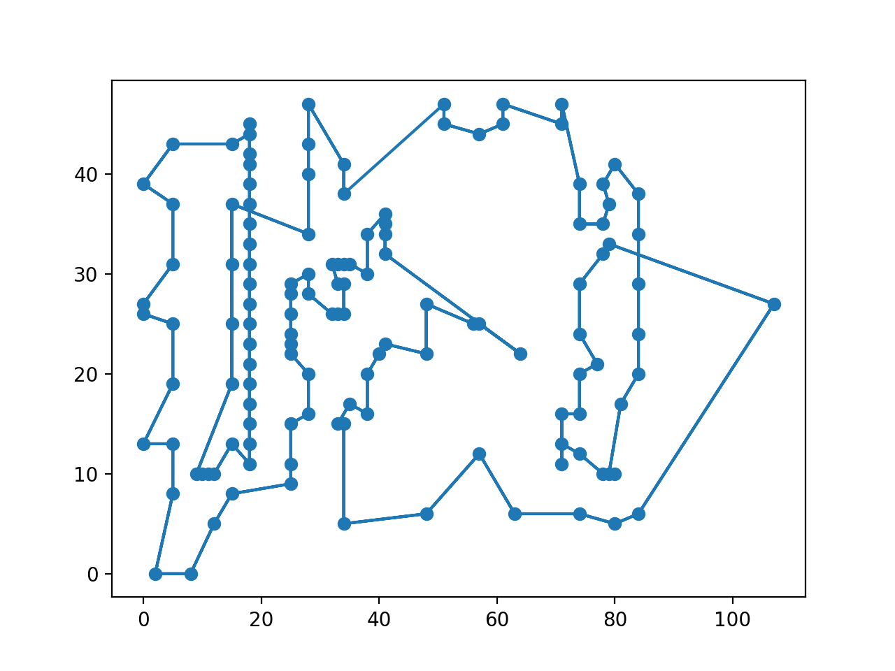

<h1 style="text-align:center"> 蚁群算法 </h1>
<h2 style="text-align:center"> Ant Colony Algorithm </h2>
<div style="text-align:center"> xyfJASON </div>


## 1 概述

蚁群算法模拟蚁群寻找食物的过程中发现路径的行为。蚂蚁在路径上释放信息素，同时又根据信息素含量作决策。随着时间的推进，较短路径上信息素积累得更快，选择该路径的蚂蚁也越来越多，最终所有蚂蚁基本都集中在最优路径上。

**本文仅用蚁群算法求解 TSP 。**

设共有 $m$ 只蚂蚁，定义 $t$ 时刻，某蚂蚁从 $i$ 地转移到 $j$​ 地的概率为：
$$
P_{ij}(t)=\begin{cases}
\dfrac{[\tau_{ij}(t)]^\alpha[\eta_{ij}]^\beta}{\sum\limits_{s\in a_i}[\tau_{is}(t)]^\alpha[\eta_{is}]^\beta}&j\in a_i\\
0&\text{otherwise}
\end{cases}
$$
其中，$a_i$​​ 是 $i$​​ 能到达的点的集合，$\tau_{ij}(t)$​​ 表示 $t$​​ 时刻 $(i,j)$​​ 边上的信息素浓度，$\eta_{ij}$​​ 表示 $(i,j)$​​​ 边的启发式因子，可设为 $\dfrac{1}{d_{ij}}$​​，$\alpha,\beta$​​ 是参数，分别表示信息素重要度因子和启发因子的重要度。

定义信息素更新方式为：
$$
\tau_{ij}(t+1)=(1-\rho)\tau_{ij}(t)+\sum_{k=1}^m\Delta\tau_{ij}^{k}(t)
$$
其中 $\rho\in[0, 1]$ 为信息素的挥发系数，$\Delta\tau_{ij}^k(t)$ 为 $t$ 时刻第 $k$ 只蚂蚁向边 $(i,j)$ 释放的信息素浓度，可定义为：
$$
\Delta\tau_{ij}^k(t)=\begin{cases}\dfrac{Q}{L_k}&\text{第 }k\text{ 只蚂蚁走了 }(i,j)\text{ 边}\\0&\text{otherwise}\end{cases}
$$
其中 $Q$ 为系数，$L_k$ 为第 $k$ 只蚂蚁走的路程总长度。


---


## 2 代码模板

```python
class AntColonyAlgorithm_TSP:
    def __init__(self,
                 n_cities: int,
                 n_ants: int,
                 T: int,
                 dis: np.ndarray,
                 eta: np.ndarray,
                 alpha: float = 1,
                 beta: float = 5,
                 rho: float = 0.1,
                 Q: float = 1) -> None:
        """
        :param n_cities: number of cities
        :param n_ants: number of ants
        :param T: maximum iterations
        :param dis: distance matrix
        :param eta: heuristic factor
        :param alpha: factor
        :param beta: factor
        :param rho: factor
        :param Q: factor
        """
        assert eta.shape == dis.shape == (n_cities, n_cities)
        self.n_cities = n_cities
        self.n_ants = n_ants
        self.T = T
        self.dis = dis
        self.eta = eta
        self.alpha = alpha
        self.beta = beta
        self.rho = rho
        self.Q = Q
        self.tau = np.ones((n_cities, n_cities))

    def single_ant_tour(self) -> Tuple[float, np.ndarray]:
        distance = 0.0
        init = np.random.randint(0, self.n_cities)
        now = init
        route = [now]
        while len(route) < self.n_cities:
            prob = (self.tau[now] ** self.alpha) * (self.eta[now] ** self.beta)
            prob[np.array(route)] = 0
            prob = prob / prob.sum()
            nxt = np.random.choice(self.n_cities, replace=False, p=prob)
            route.append(nxt)
            distance += self.dis[now, nxt]
            now = nxt
        distance += self.dis[now, init]
        return distance, np.array(route)

    def step(self) -> Tuple[np.ndarray, np.ndarray]:
        dists = np.zeros(self.n_ants)
        routes = np.zeros((self.n_ants, self.n_cities), dtype=int)
        delta_tau = np.zeros((self.n_cities, self.n_cities))
        for i in range(self.n_ants):
            dists[i], routes[i] = self.single_ant_tour()
            for u in range(len(routes[i])):
                v = (u + 1) % len(routes[i])
                delta_tau[routes[i, u], routes[i, v]] += self.Q / dists[i]
        self.tau = (1 - self.rho) * self.tau + delta_tau
        return np.min(dists), routes[np.argmin(dists)]

    def run(self) -> Tuple[float, np.ndarray]:
        best_dist = np.inf
        best_route = np.zeros(self.n_cities, dtype=int)
        with tqdm(range(self.T)) as pbar:
            for _ in pbar:
                dist, route = self.step()
                if best_dist > dist:
                    best_dist, best_route = dist, route
                pbar.set_postfix({'best dist': best_dist})
        return best_dist, best_route
```


---


## 3 旅行商问题（TSP）

http://www.math.uwaterloo.ca/tsp/vlsi/index.html

代码如下：

```python
def TSP():
    """
    For this problem, the best result is 564
    refer to https://www.math.uwaterloo.ca/tsp/vlsi/xqf131.tour.html
    """
    with open('tsp_data.txt') as f:
        data = [list(map(int, line.strip().split())) for line in f.readlines()]
        data = np.array(data)
    n = 131

    def distance(_i, _j):
        """ distance between the ith row and the jth row """
        return np.sqrt((data[_i, 1] - data[_j, 1]) ** 2 + (data[_i, 2] - data[_j, 2]) ** 2)

    dis_mat = np.zeros((n, n))
    for _i in range(n):
        for _j in range(n):
            dis_mat[_i, _j] = distance(_i, _j)
    eta_mat = 1.0 / (dis_mat + np.diag([1e10] * n))

    def evaluate(route: np.ndarray) -> float:
        dist = 0.0
        for i in range(route.shape[0]):
            j = (i + 1) % route.shape[0]
            dist += dis_mat[route[i], route[j]]
        return dist

    solver = AntColonyAlgorithm_TSP(n_cities=n,
                                    n_ants=50,
                                    T=250,
                                    dis=dis_mat,
                                    eta=eta_mat,
                                    alpha=1,
                                    beta=5,
                                    rho=0.1,
                                    Q=1)
    best_dist, best_route = solver.run()
    evaluate_dist = evaluate(best_route)
    assert(best_dist == evaluate_dist), '%f != %f' % (best_dist, evaluate_dist)
    print('best dist:', best_dist)
    print('best route:')
    print(best_route)
    print('Pheromone along the route:')
    phe = []
    for _i in range(len(best_route)):
        _j = (_i + 1) % len(best_route)
        phe.append(solver.tau[best_route[_i], best_route[_j]])
    print(phe)
    print('Maximum pheromone:', np.max(solver.tau))
    print('Minimum pheromone:', np.min(solver.tau))

    def plot_route(route) -> None:
        fig, ax = plt.subplots(1, 1)
        ax.scatter(data[:, 1], data[:, 2])
        ax.plot(np.hstack((data[route, 1], data[route, 1])),
                np.hstack((data[route, 2], data[route, 2])))

    plot_route(best_route)
    plt.show()
```

结果如下（每次运行结果不同）：

```python
best dist: 615.4308966694757
best route:
[ 90  89  94  95  96 102 103 110 109 115 119 116 121 128 127 126 125 124
 123 117 120 113 104 100  99 101 105 106 112 107 108 114 118 130 129 122
 111  97  92  88  73  67  63  74  76  77  80  81  86  87  91  93  98  82
  83  84  85  79  78  75  70  66  62  65  69  68  64  61  55  56  51  50
  49  48  47  46  54  53  45  44  52  24  17  12   4  11   5   0   6   7
   1   2   8   9   3  10  23  42  43  41  40  39  38  37  36  35  34  33
  32  31  30  29  28  27  26  25  18  16  15  14  13  19  20  21  22  57
  58  59  60  72  71]
Pheromone along the route:
[0.07224270929327124, 0.0675053809680273, 0.35893335639356494, 0.41924413027711915, 0.0999910862666323, 0.4346637284846607, 0.10232838632417086, 0.34527180809298164, 0.19678234232926034, 0.47260113193079145, 0.46695823879756193, 0.4858499851339199, 0.48745956886709507, 0.49392389113616636, 0.48671351971655324, 0.504877086879352, 0.5039665429400546, 0.49103318107302313, 0.0006501295056396967, 0.329801466899241, 0.006230640504527776, 0.2605282398072655, 0.2236310310306964, 0.4287487519459899, 0.07656852968944698, 0.4160680059008197, 0.29062815991244184, 0.4631261871483014, 0.3373680923194794, 0.4271499729532951, 0.43439797991904733, 0.4614800890007511, 0.08058538403545998, 0.03534139764988953, 0.028825069745294557, 0.023592864584641937, 0.23643763017491704, 0.37852794525815736, 0.4045112287266663, 0.33311979156321553, 0.2248723295061656, 0.49927849012262826, 0.22983807399046455, 0.4275281465808147, 0.40349842041036543, 0.4246468342924602, 0.4902598179304797, 0.4394114852274127, 0.46418530561560284, 0.45622347270260394, 0.5053364093188002, 0.48400318083535054, 0.0036911552566313965, 0.33601793329592317, 0.4868103196028001, 0.49885795650062514, 0.34402134928159317, 0.0025757620256927254, 0.31697990895605815, 0.31561583195781945, 0.36322540430089745, 0.4992728422533307, 0.328540728229567, 0.41334955892600633, 0.3331004669431225, 0.4112613085994175, 0.4828756967625244, 0.2983512845437855, 0.3575520954796082, 0.2365491451965163, 0.2672229774449289, 0.2652982665546491, 0.44013530895866876, 0.44025859796998795, 0.4493665922916425, 0.44417073727853756, 0.3960526431942569, 0.49375092679100996, 0.48753970615378983, 0.507575235071066, 0.07123736637966015, 0.6198519451885454, 0.6390645879498946, 0.678667257760304, 0.06250107168109671, 0.6757072362469345, 0.6926687305096493, 0.6748406113211589, 0.6753799553905715, 0.6746165112425687, 0.6791631174180912, 0.673142502715658, 0.6748452204614463, 0.6871345505525993, 0.678231538551658, 0.31509668836542043, 0.051051977826980635, 0.507126119447753, 0.04847576765247872, 0.32399037201651293, 0.324969132418179, 0.32572330135032374, 0.3363639878073273, 0.3414128687444486, 0.34143878675379224, 0.35054430812644927, 0.3538847164863923, 0.34410065989540917, 0.3561251031868064, 0.3599056527654074, 0.3539285836966289, 0.36366332636447285, 0.369199982613429, 0.3623090044226002, 0.3603003747755122, 0.3525949305161222, 0.6386547442373817, 0.663952124471189, 0.6630959940224987, 0.673780071978614, 0.01642190329132746, 0.1072595198214532, 0.09944420792893055, 0.1031511717897555, 0.03099220897944021, 0.04012875273260399, 0.29624290058028235, 0.3236792504064072, 0.06364849145081633, 0.16010069162835028, 0.00010169036247157422]
Maximum pheromone: 0.6926687305096493
Minimum pheromone: 3.6360291795870155e-12
```



